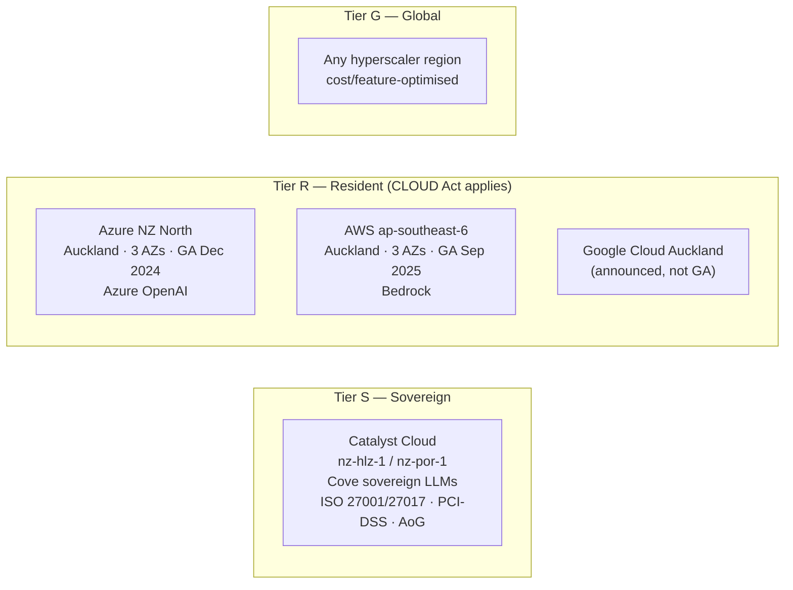
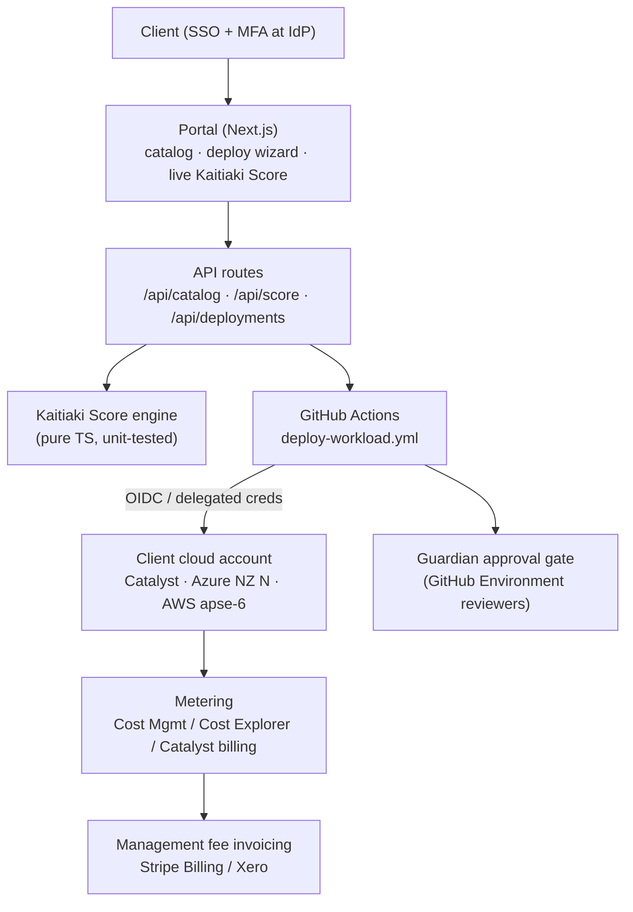

# Kaitiaki Cloud — Reference Architecture

## 1. Product thesis

Self-service AI landing zones already exist via hyperscaler partners (Datacom, Lancom,
Mantel, Theta). The defensible wedge is **data sovereignty as a selectable posture**, with
an accountability framework — the Named Guardian Model and the Kaitiaki Score — baked into
every deployment and aligned to ISO 27001 / COBIT / NZISM and te Tiriti. We sell clarity
first (residency ≠ sovereignty), then the governed infrastructure to act on it.

## 2. Sovereignty tiers (grounded, mid-2026)

Classification floor enforced at three layers (control plane, score engine, Terraform
`check` block):

| Classification | Minimum tier |
|---|---|
| Māori data (taonga), health, official information | **S** |
| Confidential, internal | **R** |
| Public | **G** |

## 3. Control plane

Key property: **the control plane never fronts compute.** Delegated access means the
client's consumption hits the client's bill. The control plane itself fits in free tiers
(Vercel/Cloudflare Pages, WorkOS/Auth0 B2B free tier, GitHub Actions free minutes).

## 4. The Kaitiaki Score

Five pillars, weights summing to 100 (`src/lib/kaitiaki.ts`):

| Pillar | Weight | Measures |
|---|---|---|
| Whakapapa o te raraunga | 30 | Jurisdiction & ownership of the platform holding the data |
| Kaitiakitanga | 25 | Named guardian assigned + review cadence ≤ 90 days |
| Ngā here ture | 20 | Backend certifications + encryption + SSO/MFA |
| Mana raraunga | 15 | Classification fit against the tier floor |
| Aroturuki | 10 | Audit logging, hard budget cap, DLP |

Rules that matter:

- Taonga / health / official data below Tier S is a **violation**, not a deduction: it
  zeroes Mana raraunga, caps the grade at C, and tops the recommendation list with
  "move to Tier S".
- The same gate exists as a Terraform `check` block in `governance-baseline`, so even a
  hand-run `terraform plan` refuses the misconfiguration. Defence in depth.
- The wizard scores live (`POST /api/score`) so the posture consequence of every toggle is
  visible *before* deployment.

## 5. Landing-zone anatomy (Sovereign RAG example)

Every workload = governance-baseline + workload module for the chosen backend:

- **governance-baseline** — guardian tags on every resource, budget cap wiring,
  review-cadence metadata, sovereignty gate.
- **sovereign-rag/catalyst** — object storage corpus + ingestion instance; generation via
  Cove's sovereign inference API (no GPUs owned).
- **sovereign-rag/azure** — resource group, ZRS storage, AI Search, Azure OpenAI, and an
  `azurerm_consumption_budget_resource_group` with guardian-addressed alerts.
- **sovereign-rag/aws** — KMS-encrypted S3 corpus, OpenSearch Serverless vector collection,
  `aws_budgets_budget` with 80% forecast / 100% actual notifications.

## 6. Billing model

- **Phase 0/1 — delegated-account:** flat per-workload management fee (catalog lists NZD
  fees) or 15–25% of consumption; hard caps via cloud-native budget actions. Low liability,
  fast to launch.
- **Phase 2 — CSP/reseller:** Microsoft CSP / AWS reseller / Catalyst resale for true
  prepaid credits with hard stops. More margin, but revenue commitments and credit risk —
  gated on volume.

## 7. Honest flags carried into the design

- "Near-zero investment" covers the control plane, not founder time or support burden —
  hence one hero SKU (Sovereign RAG) before catalog breadth.
- Deploying into client environments creates real liability: the MSA, the guardian approval
  gate on `terraform apply`, and the audit trail are all load-bearing.
- Trust story: lean on backend certifications initially; plan own ISO 27001 / NZISM
  alignment when moving upmarket.
